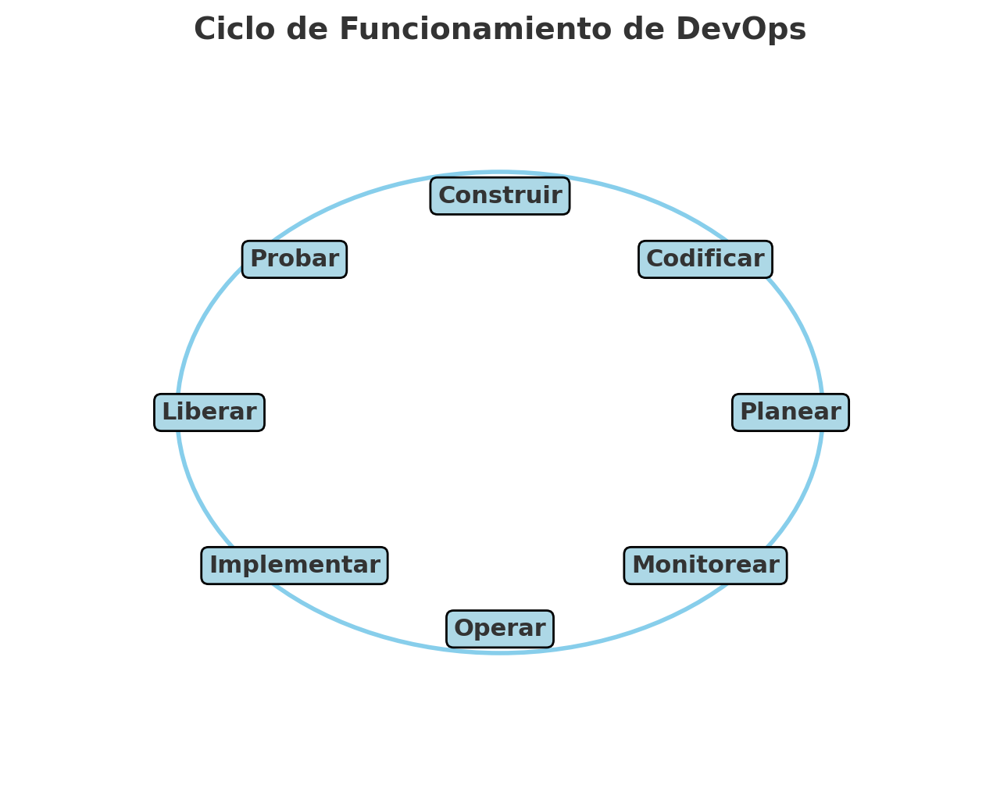

# Actividad 3 - Integración de DevOps y DevSecOps con HTTP, DNS, TLS y 12-Factor App

## Parte teórica
- Introducción a DevOps: ¿Qué es y qué no es? 

DevOps según mi interpretación es una metodología de trabajo en equipo el cuál se basa principalmente en reemplazar el sistema anterior que se poseía ya que ese sistema, volvía independiente a cada parte del proyecto, por ende los tiempos de producción eran sumamente largos, pero ahora con esta nueva metodología, lo que se hace es mantener una conexión entre las 3 partes de producción para solucionar cualquier error que anteriormente generaria dias o semanas de re producción, pero ahora en corto tiempo se solucionaría para continuar con el proceso.
Proceso de ejecución:



- Marco CALMS en acción: Describe cada pilar y su integración en el laboratorio (ej. Automation con Makefile, Measurement con endpoints de salud). Propón extender Sharing con runbooks/postmortems en equipo./
**Culture**: La integración de archivos **Makefile**, **app.py**, **Nginx** sirve para que exista un conjunto de archivos que permite que no haya huecos entre desarrolladores y operadores
**Automation**: En el **Makefile** se puede evidenciar este uso ya que con esto poniendo de ejemplo, la instalación de dependencias o creación de entornos virtuales sobre los que trabajar, lo que se haría con varias líneas de código como 
```bash
python -m venv bd
source bd/script/activate
```
En el **Makefile** se reemplazarís con una sola línea
```bash
Make prepare
```
Y así nos ahorramos 2 líneas de código, lo cuál no parece gran cosa en este ejemplo pero en caso sea un script grande como verificaciones de los protocolos HTML, o TLS, en vez de escribir todo el comando, simplemente lo designamos por ejemplo a la tarea **check** en el Makefile y lo corremos con **Make check**
**Lean**: En el laboratorio se usa la infraestructura como código para generar un despliegue automatiado lo cuál va a reducir tareas manuales, ganando así velocidad de ejecución y evitar errores, este ejemplo se refleja con **Make run**
**Measurement**: En el laboratorio vemos que se usa el **curl** command, lo cuál nos serviría para ejecutar peticiones HTTP, así que con ello, es posible observar métricas, como la latencia, tiempo de conexión, o verificar el mismo código fuente http de la página a buscar para en caso de DevSecOps, buscar errores o vulnerabilidades sobre las cuales sacar proecho
**Sharing**: El pilar de compartir, se basa basicamente en la documentación de todos los procesos para así compartir y evidenciar todo lo realizador, para tener una trazabilidad de las acciones hechas en el proyecto y sea más fácil rastrear el origen de las modificaciones, y así al momento de que haya un nuevo integrante, pueda realizar el paso a paso de las modificaciones para poder tener el mismo sistema que todos poseen sin cambio o diferenciación alguna


- Visión cultural de DevOps y paso a DevSecOps: Analiza colaboración para evitar silos, y evolución a DevSecOps (integrar seguridad como cabeceras TLS, escaneo dependencias en CI/CD). Propón escenario retador: fallo certificado y mitigación cultural. Señala 3 controles de seguridad sin contenedores y su lugar en CI/CD.

Tip: Usa el archivo de Nginx y systemd para justificar tus controles.

- Metodología 12-Factor App: Elige 4 factores (incluye config por entorno, port binding, logs como flujos) y explica implementación en laboratorio. Reto: manejar la ausencia de estado (statelessness) con servicios de apoyo (backing services)./

**Config**:Para la configuración de entorno, vemos que en el makefile, ya se designan las variables de entorno que van a ser el puerto, y la ejecución de la aplicación app.py, y todo eso agregado en **make run** para que se genere de manera automática

**Por Blinding**: Este enlace de puerto, se verifica al momento de levantar la aplicación, la cual se hace en el puerto 8080, indicando que al momento de correr la aplicación, podremos entrar a la interfaz, mediante la ip 127.0.0.1:8080 o escribiendo localhost:8080, y esto es importante porque el puerto 8080 tiene que se un puerto libre por lo que en las configuraciones de entorno, se tiene que exponer al puerto a usar para poder levantar la app ahí y sea posible su enlace

**Log**: Los logs son basicamente el historial o el flujo de eventos, y flask nos imprime los eventos en la misma terminal, ya que al momento de nosotros ingresar o ejecutar algún comando que tenga acceso a la interfaz, lo que ocurrirá será que al ejecutarte el comando, en la terminal que levanta la aplicación, nos imprimirá una descripción del evento a realizar para así tener un historial sobre el cuál basarnos en el momento de revisar los eventos obtenidos en la app

**Stateless processes y solución**: Como se puede apreciar al correr el programa, apagarlo y volver a correrlo, la aplicación no tiene un mecanismo de almacenamiento de datos, por lo que en caso sea una interfaz que simule la agregación de datos mediante métodos **POST**, al reiniciar la app, no se tendrá registro de esto, por lo que una solución es tener una conexión a una base de datos sobre la cual al ejecutar la aplicación, tenga como base el último estado guardado en la base de datos, y al momento de ejecutar alguna solicitud HTTP que modifique la base de estado, esta se actualice para así al reiniciar, no tener modificaciones no realizadas.


## Parte práctica
### Automatización reproducible con Make y Bash (Automation en CALMS)
Como aún no existe el script **make deps** en el archivo Makefile, lo que hice fue crearlo el cuál se va a basar en pasos simples
- Eliminar la venv creada anteriormente
- Crear la venv
- Entrar a la venv
- Actualizar el pip
- Instalar las dependencias guardadas en el archivo requirements.txt
Hice esto con el objetivo de tener un ambiente más automatizado, donde solo con ese script, ya tendremos listo todo el entorno y las dependencias en vez de instalar las dependencias de uno en uno

```Makefile
.PHONY: deps
deps:  #$(VENV) ## Instalar dependencias de la app en la venv ya creada
	@echo "Eliminando la venv anterior"
	@rm -rf $(VENV)
	@echo "Creando venv con: $(PY_BOOT) -m venv --prompt $(VENV_PROMPT) $(VENV)"
	@$(PY_BOOT) -m venv --prompt "$(VENV_PROMPT)" $(VENV)
	@echo "Entrando a la venv bdd e instalando el archivo requirements.txt (si existe)..."
	@$(PIP) install --upgrade pip > /dev/null
	@$(PIP) install -r requirements.txt > /dev/null
	@echo "Dependencias instaladas."
```
Los demás comandos **make run**, **make hosts-setup** y **make cleanup** si corren con normalidad y al levantar la aplicación podemos entrar mediante el navegador a 127.0.0.1:8080 y notaremos que se levantó la app correctamente

### Del código a producción con 12-Factor (Build/Release/Run).


### HTTP como contrato observable.
Para inspeccionar la cabecera de la web, lo único que haremos será ejecutar el siguiente comando curl el cuál envía una petición HTTP y nos permite obtener resultados de la web de acuerdo a lo que quiere
```bash
# Comando
curl -I 127.0.0.1:8080

# Resultado
HTTP/1.1 200 OK
Server: Werkzeug/3.1.3 Python/3.12.5
Date: Mon, 08 Sep 2025 08:20:52 GMT
Content-Type: application/json
Content-Length: 60
Connection: close
```
Y las operaciones que son seguras para reintentos, son basicamente las idempotentes, que al ejecutar una y otra vez, siempre darán el mismo resultado, las cuales son las operaciones **GET**, **PUT**, **DELETE**, en cambio ejecutar una operación **POST** lo que generaría podría ser que exista un duplicado de elementos al ejecutarlo más de una vez

Para la última parte creamos dos rutas para la app, **readyz** y **livez** las cuales al llamar solo nos darán como respuesta un estado 200 en caso la ruta exista
```bash
@app.route("/readyz")
def readyz():
    try:
        return {"status": "ok"}, 200
    except:
        return {"status": "unavailable"}, 503

@app.route("/livez")
def livez():
    return {"status": "alive"}, 200
```

**Respuesta**
```bash
CHRISTIAN@LAPTOP-C7BQJMK9 MINGW64 ~/Downloads/DS-25-2/CC3S2-A_25-2_20211374B/Actividad3-CC3S2/Laboratorio1 (main)
$ curl 127.0.0.1:8080/readyz
{"status":"ok"}

CHRISTIAN@LAPTOP-C7BQJMK9 MINGW64 ~/Downloads/DS-25-2/CC3S2-A_25-2_20211374B/Actividad3-CC3S2/Laboratorio1 (main)
$ curl 127.0.0.1:8080/livez
{"status":"alive"}

```
Para la lectura de latencias, usaremos el comando
```bash
curl -o /dev/null -s -w "time_namelookup: %{time_namelookup}\n\
time_connect: %{time_connect}\n\
time_appconnect: %{time_appconnect}\n\
time_starttransfer: %{time_starttransfer}\n\
time_total: %{time_total}\n" http://127.0.0.1:8080/
```
Con la cuál nos permitirá inspeccionar las métricas con **curl -w** para así tener visibilidad de la latencia DNS, conexión TCP, tiempo hasta el byte, etc
**Respuesta**
```bash
CHRISTIAN@LAPTOP-C7BQJMK9 MINGW64 ~/Downloads/DS-25-2/CC3S2-A_25-2_20211374B/Actividad3-CC3S2/Laboratorio1 (main)
$ curl -o /dev/null -s -w "time_namelookup: %{time_namelookup}\n\
time_connect: %{time_connect}\n\
time_appconnect: %{time_appconnect}\n\
time_starttransfer: %{time_starttransfer}\n\
time_total: %{time_total}\n" http://127.0.0.1:8080/
time_namelookup: 0.000031
time_connect: 0.001119
time_appconnect: 0.000000
time_starttransfer: 0.002135
time_total: 0.002189
```


### TLS y seguridad en DevSecOps (Reverse Proxy).
