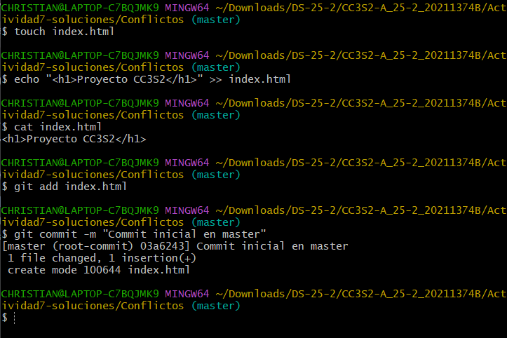
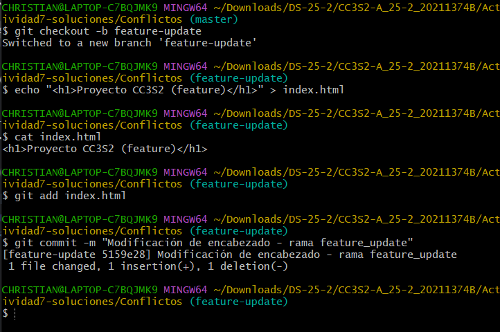
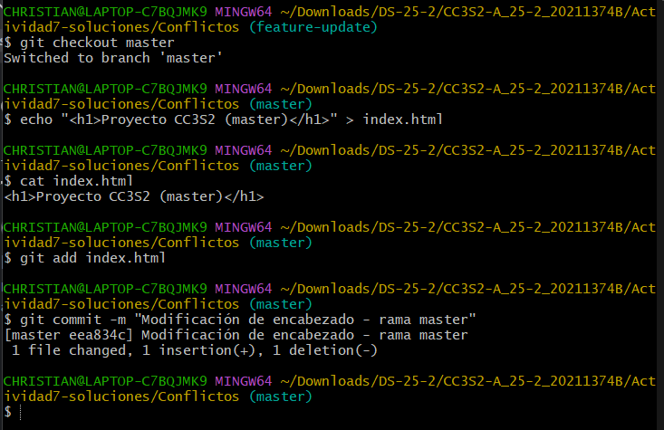
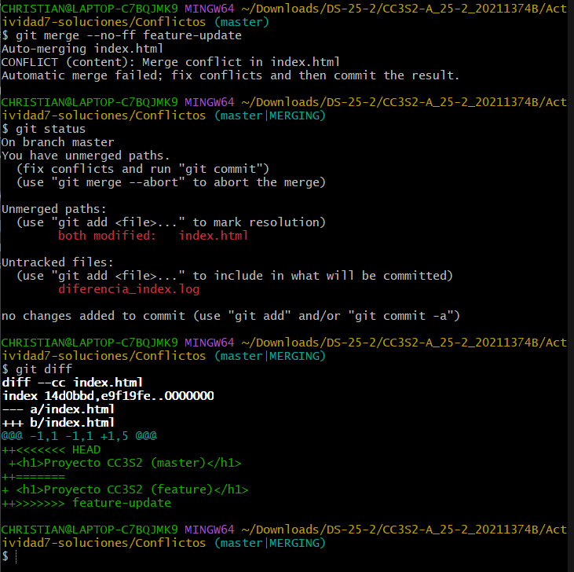
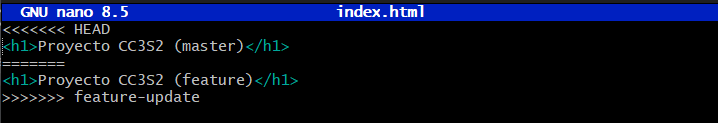
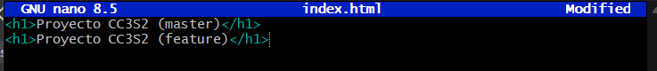

> Guarda salidas con redirección, p. ej.:
> `git log --graph --oneline --decorate --all > evidencias/01-ff.log`

Actividad7-CC3S2/
├─ evidencias/
│  ├─ 01-ff.log
│  ├─ 02-no-ff.log
│  ├─ 03-squash.log
│  ├─ 04-conflicto.log
│  ├─ 05-compare-fastforward.log
│  ├─ 06-compare-noff.log
│  ├─ 07-compare-squash.log
│  ├─ 08-revert-merge.log
│  ├─ 09-ff-only.log
│  ├─ 10-rebase-ff.log
│  ├─ 11-pre-commit-merge.log
│  ├─ 12-octopus.log
│  ├─ 13-subtree.log
│  ├─ 14-x-strategy.log
│  ├─ 15-signed-merge.log
│  └─ capturas/  (opcional: imágenes de PRs o del DAG)

- Fast-Forward

Creé un directorio llamado Fast-Forward, sobre la cuál realicé los siguientes pasos:

> Lo que hice fue primero crear un archivo **README.md** en la rama master o main, commitear esa modificación, luego crear una rama **git checkout -b feature-1** y realizar otro commit en esa misma rama.
Al terminar de hacer eso, volver a la rama master con **git checkout master** y luego de eso realizar un merge fast-forwar **git merge feature-1**, no se pone de manera literal que es **git merge --ff** porque si no se menciona, el git merge ejecuta una fusión fast forward, luego ejecutamos el comando
**git log --graph --oneline --decorate --all > 01-ff.log**

[01-ff.log](01-ff.log)


## Resolución de parte teórica

### Ejercicios guiados (responde en `README.md`)

#### A) Evitar (o no) `--ff`

* Ejecuta una fusión FF real (ver 1).
* **Pregunta:** ¿Cuándo **evitarías** `--ff` en un equipo y por qué?

- Según mi opinión, yo evitaría más que nada un merge --ff cuando quiero mantener un historial limpio, ya que el **merge --ff** lo que hace es que al cambiar el apuntado del HEAD, lo que sucede con el historial de commits es que ahora tendrá agregado a todos los commits realizados en esa rama, por eso para mantener un historial limpio y menos confuso para mi y mi equipo, evitaría usar un **merge --ff** y optaría por un **merge --no-ff**

#### B) Trabajo en equipo con `--no-ff`

* Crea dos ramas con cambios paralelos y **fusiónalas con `--no-ff`**.
* **Preguntas:** ¿Qué ventajas de trazabilidad aporta? ¿Qué problemas surgen con **exceso** de merges?

- En las ventajas de trazabilidad, como se dijo antes, ayuda a mantener un historial sumamente limpio y ordenado, porque genera un nuevo commit en la rama principal, la cual tiene los cambios realizados en la rama paralela, generando así que el historial de commits no se vea tan alborotado con todos los cambios que se hicieron en la rama paralela, sino que se genera un nuevo commit con los cambios.
- Los problemas que surgen en el exceso de merge, o de commits, es la modificacion de un mismo archivo, el cual al unir las ramas, nos generará errores que se tienen que resolver manualmente, y en caso tengamos varias ramas en paralelo, y todas las fusionamos con **merge --no-ff**, lo que pasará será que en el peor de los casos, estaremos llenos de errores los cuales nos tomarán mucho más tiempo en arreglar, y en ese caso preferimos usar un **merge --ff** con el riesgo de alterar y manejar un historial sumamente desordenado

Como ejemplo de esto se puede apreciar en los archivos **.log** que cree los cuales no se indican como entega pero ayuda a explicar estas modificaciones paralelas

* [**Version corta**:](Evidencias/extra_parallel_modify.log)
* [**Version larga**:](Evidencias/extra_parallel_modify-long.log)

#### C) Squash con muchos commits

* Haz 3-4 commits en `feature-3` y aplánalos con `--squash`.
* **Preguntas:** ¿Cuándo conviene? ¿Qué se **pierde** respecto a merges estándar?

- Usar squash conviene cuando los cambios son muchos y pequeños o desornados, ya que lo que se pierde al aplicar esto, es que se ven todos los commits hechos pero en un conjunto, y se pierde esa individualidad de commits


### Creación de conflictos

#### Conflictos reales con **no-fast-forward**
- Para esta parte lo primero que haremos será crear un archivo **index.html** la cual contendrá solo un encabezado con el nombre de **Proyecto CC3S2**:


- Luego creamos una rama **git checkout -b feature-update** en la cual vamos a cambiar el encabezado de **index.html** para que sea **Proyecto CC3S2 (feature)**:


- Ahora modificaremos nuevamente el encabezado pero ahora desde la rama master, con el objetivo de que ambas líneas de **index.html** sean distintas en ambas ramas


Para ver esta diferenciación podemos usar git diff para verificar que hasta este punto, la rama master y feature tienen modificada la misma línea desde el punto que se creó la rama

[Diferencia entre master y feature](Evidencias/diferencia_index.log)

- Al terminar de modificar la rama master, lo que haremos será desde esa rama, realizar un **merge --no-ff** con feature el cuál nos debería de dar error o mejor dicho, un conflicto en el proceso de fusionar las ramas


- Al usar git diff, vemos que nos aparece algo como
```bash
++<<<<<<< HEAD
 +<h1>Proyecto CC3S2 (master)</h1>
++=======
+ <h1>Proyecto CC3S2 (feature)</h1>
++>>>>>>> feature-update
```
Para arreglar el conlifcto, debemos de editar el archivo **index.html** y eliminar esos simbolos **<<<<<<<**, **=======** y **>>>>>>>**.
Para ello usaremos el comando
```bash
nano index.html
```
El cuál nos abrirá un editor de texto sobre el cuál podremos modificar y guardar el archivo **index.html**

Editando el archivo **index.html** nos tendría que quedar así:

Luego ejecutamos:
```bash
git add index.html
git commit 
```
Para guardar los cambios y terminar con el merge --no-ff

- Por último, guardamos el historial de commits en el archivo [**04-conflicto.log](Evidencias/04-conflicto.log)

**Preguntas**

* ¿Qué pasos adicionales hiciste para resolverlo?
Los pasos adicionales que hice fueron más que nada el arreglado del problema al momento de crearse el merge, ya que estos cambios se hacen manualmente por lo que para tener un script que automatice las fusiones de ramas, es muy peligroso en caso no se tome en cuenta estos temas

* ¿Qué prácticas (convenciones, PRs pequeñas, tests) lo evitarían?
Las prácticas que lo evitarían sería la creación de un pipeline que se llamaría **pre-merge** el cuál se ejecutaría antes de crear el merge, o mejor dicho, que antes de ejecutar el merge, haga una verificación de que no habrá conflicto al realizarlo, para así poder generar un merge sin conflictos y de manera automática


**Preguntas**

* ¿Cómo se ve el DAG en cada caso?
El DAG tiene una variación notoria en cada caso
- merge --ff: Tiene un DAG lineal, y esto se debe a que solo se mueve el apuntado del HEAD, por lo que no se aprecian ramas existentes sino la rama a la que se le hizo el merge, esa rama será la nueva principal, basicamente la rama principal pasa a ser la otra rama
- merge --no-ff: Tiene un DAG que nos permite apreciar la vinculaciónd de ramas, para así verificar su existencia, y esto se debe a que se genera un nuevo commit que une a las dos ramas, es decir, este nuevo commit tiene dos ramas padre, es por ello que gracias a ese commit, se genera un DAG entendible y mantiene el historial de commits de la rama principal
- merge --squash: Su DAG es parecido al de **merge --no-ff** pero en lo que varía, es en la vinculación de ramas, porque se genera un nuevo commit pero este commit tiene solo una rama padre, la cual es la rama principal o sobre la que se hizo el squash, y esto se debe a que squash no une las ramas en una sola, sino que basicamente genera un commit en la rama principal, que agrupa todos los cambios que posee la otra rama, y así la diferencia de DAG se basa en que el nuevo commit no se vincula a la otra rama, sino que pertenece solo a la rama principal

* ¿Qué método prefieres para: trabajo individual, equipo grande, repos con auditoría estricta?
- Individual: Fast-Forward, porque creo que como es propio, no es necesario mantener un historial tan limpio ya que uno mismo sabe que realizó
- Equipo Grande: Squash, ya que para estos equipos, nos basariamos mejor en cambios pequeños y continuos, por eso lo mejor sería mantener un merge squash ya que este va agrupar todos los cambios pequeños y unirlos en uno solo, por lo que en este caso los cambios pequeños no serán accesibles pero como son pequeños, no habrá tanto problema en caso de conflicto
- Auditoria estricta: Merge --no-ff, ya que aquí si será necesario mantener un historial completo de todo lo realizado, y en que momento se unieron las ramas y que commits provienen de ese merge, por lo que para mantener un control total del historial yo creo que sería este método

**Preguntas**

* ¿Cuándo usar `git revert` en vez de `git reset`?
Git revert podemos usarlo cuando queremos mantener el cambio o rollback en el historial de commits, ya que este generará un nuevo commit con la versión donde se ha regresado, pero con git reset, no se mantendrá ningún commit, es decir que solo se mueve el HEAD a ese commit

* ¿Impacto en un repo compartido con historial público?
Si tiene un impacto, al usar git revert la repo compartida nos identificará la regresión de commit que hemos hecho, mientras que con git reset lo que se ve es solo de manera local que ahora apuntamos a otro commit con los cambios